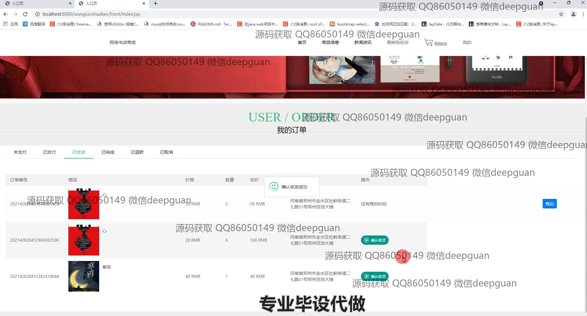
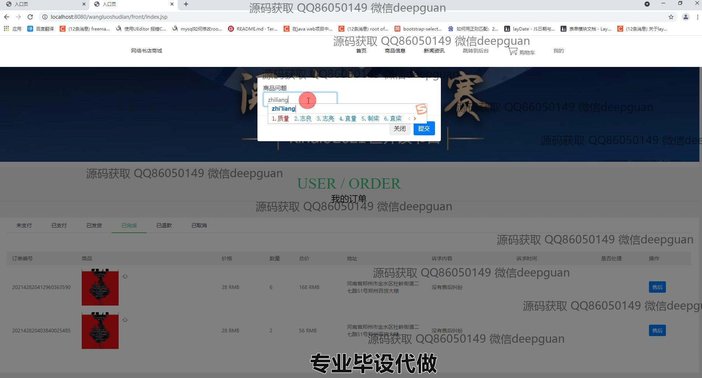

<h1 align="center">基于jsp的网络书店系统</h1>

## 简介
基于Spring MVC、MyBatis的网络书店系统：角色分为管理员、用户；提供用户管理、商品信息管理、订单管理、购物车、个人中心等功能，实现简洁易用的在线购书体验。    --计算机毕业设计源码；毕设源码；java毕业设计源码

## 联系方式

<h3 align="center">获取完整代码与数据库文件 + 微信：deepguan QQ: 86050149 QQ群: 783742310</h3>

<h3 align="center">可帮忙远程部署 包运行成功！提供远程部署、修改代码、设计文档指导、代码讲解等服务！</h3>

## 功能介绍（完整见运行截图）
管理员： 管理员登录系统后可进行用户管理，包括创建、修改和删除用户信息，以及商品分类和商品信息的管理。管理员可查看、添加、修改、删除商品分类，或进行商品的上下架、库存调整和删除操作。此外，管理员有权限查看和处理订单，管理系统模块，进行订单状态更新与售后回复，确保系统运行的可靠性和有效性，通过文件对话框上传商品图片，提升商品展示效果。 用户： 用户通过登录和注册功能访问系统，浏览首页的商品推荐和新闻资讯；在商品信息页面查看商品详情，添加商品到购物车或直接购买。用户拥有个人中心，查看和修改个人信息、管理收货地址、收藏商品及查看订单状态，如未支付、已支付或已完成等。用户可通过搜索功能便捷查找书籍，并在订单确认界面选择确认收货，体验便捷的在线购书服务。

## 运行截图

本代码来源于网络,仅供学习参考使用!

